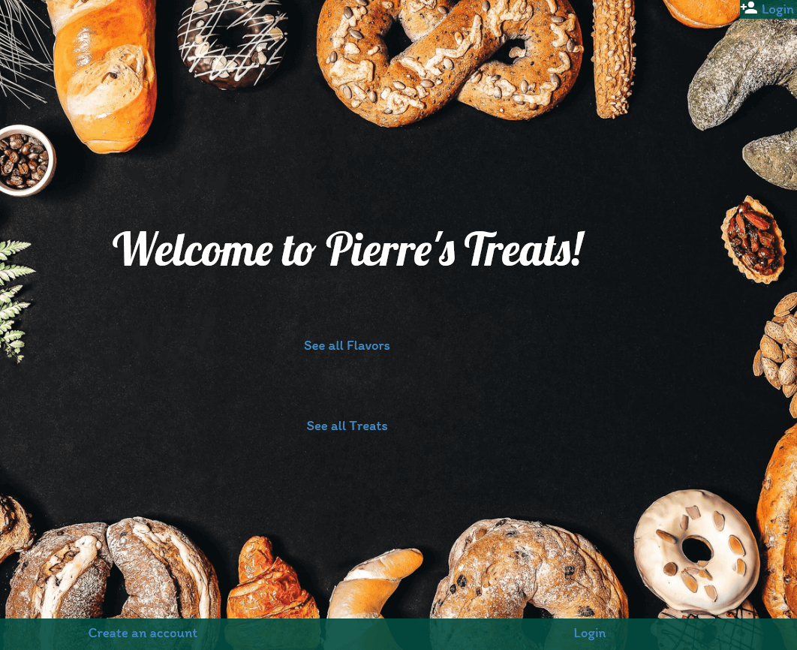
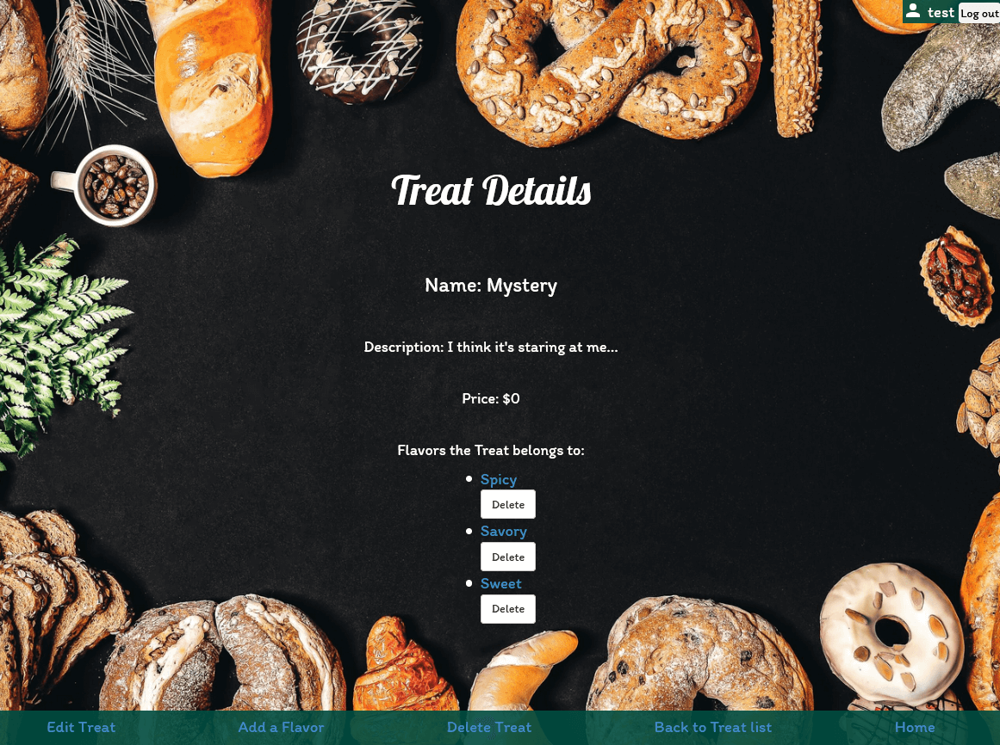
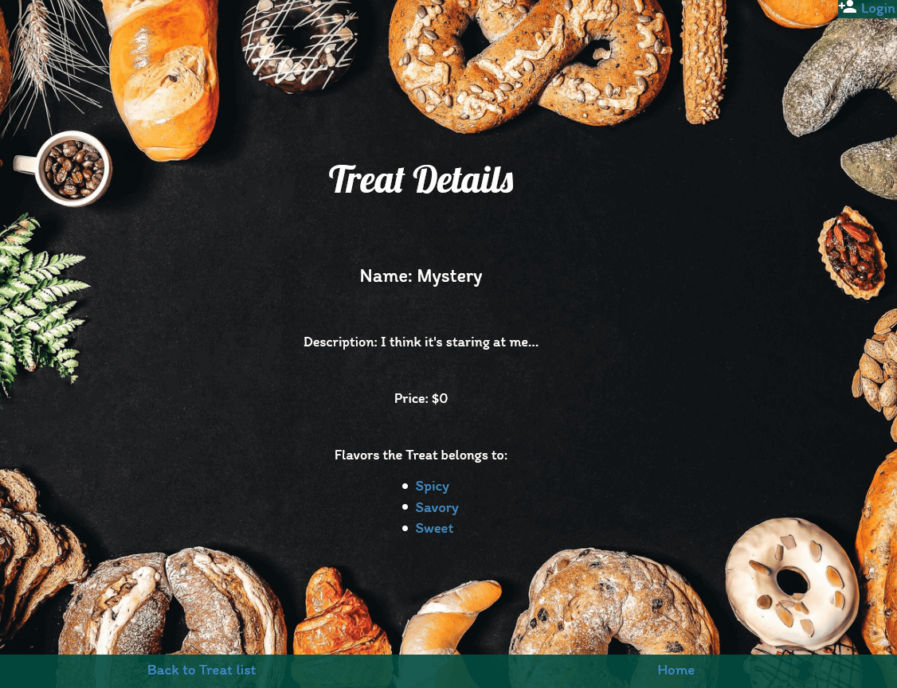
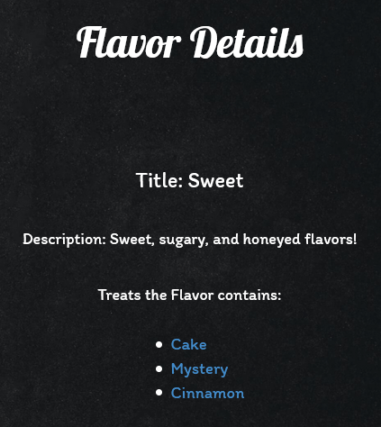
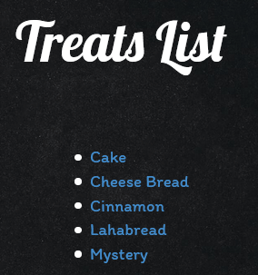

# _[Pierre's Sweet and Savory Treats](https://github.com/TSiu88/SweetAndSavoryTreats)_

#### _Week 12 Friday Independent Assignment, 03.27.2020_

#### By _**Tiffany Siu**_

---
## Table of Contents
1. [Description](#description)
2. [Setup/Installation Requirements](#setup/installation-requirements)
    - [Requirements to Run](#requirements-to-run)
    - [Instructions](#instructions)
    - [Other Technologies Used](#other-technologies-used)
3. [Notable Features](#notable-features)
4. [Specifications](#specifications)
5. [User Stories](#user-stories)
6. [Screenshots](#screenshots)
7. [Known Bugs](#known-bugs)
8. [Support and Contact Details](#support-and-contact-details)
9. [License](#license)
---
## Description

This application is the Week 12 Friday independent assignment for Epicodus' full time Intro to Programming and C#/React course.  This is an application made to show use of a many-to-many database and use of authentication with Identity.

This application was created to market a baker's sweet and savory treats.  Only users that can log in are able to create, update, and delete the different items in the database but anyone could view them without logging in.  The application shows different treats and different flavors and is flexible in allowing items of one type to be connected to many of the other type (like having a Cinnamon treat be in the flavors Sweet and Spicy or the flavor Sweet having cookies and cake connected to them).  Interlinked details pages for both flavors and treats makes it easy to find other related items.

## Setup/Installation Requirements

_This program requires .NET Core SDK to run. [Here is a free tutorial](https://www.learnhowtoprogram.com/c-and-net/getting-started-with-c/installing-c-and-net) for installing .NET on Mac or Windows 10 from the [official website](https://dotnet.microsoft.com/download/dotnet-core/)._ 

_This program also makes use of SQL databases. We recommend using MySQL Workbench to build your databases. [Here is a free tutorial](https://www.learnhowtoprogram.com/c-and-net/getting-started-with-c/installing-and-configuring-mysql) for installing MySQL WorkBench and MySQL Community Server on Mac (using links [Mac1](https://dev.mysql.com/downloads/file/?id=484914) and [Mac2](https://dev.mysql.com/downloads/file/?id=484391)) or [Windows 10](https://dev.mysql.com/downloads/file/?id=484919)._

### Requirements to Run

* _.NET Core_
* _ASP.NET Core MVC_
* _MySQL Workbench_
* _MySQL Community Server_
* _Entity Framework_
* _ASP.NET Core Identity_
* _Command Prompt_
* _Web Browser_ 

### Instructions

*This application may be viewed by:*

1. Download and install .NET Core from the [official website](https://dotnet.microsoft.com/download/dotnet-core/)
2. Download and install MySQL Workbench and Community Server for Mac or Windows by following the instructions [here](https://www.learnhowtoprogram.com/c-and-net/getting-started-with-c/installing-and-configuring-mysql).
3. Click clone the [repository](https://github.com/TSiu88/SweetAndSavoryTreats.git) from my [GitHub page](https://github.com/TSiu88) to copy the repository link
4. Use a command line interface to type `git clone (repository-link-here)` to copy the project into the current folder and then move into the repository's directory that was just created with `cd (project-name-here)`
5. Start up a local server by opening MySQL Workbench and adding a `MySQL Connections` using the default IP address and Port (IP 127.0.0.1, Port 3306), username (root), and password from setup.
6. Run `dotnet restore` and `dotnet build` in command line interface of the repository's main project directory
7. Run `dotnet run` to start up the program in the command line interface
8. Type the URL listed under "Now listening on:" into a web browser to run

## Other Technologies Used

* _C#_
* _HTML_
* _CSS_
* _Razor_
* _Markdown_ 

## Notable Features
This application uses a partial view to make the log in name and log out button or a login button be continuously shown in the upper right hand corner.

## Specifications

  
Click to expand to view specifications

| Specification | Input | Output |
| :-------------     | :------------- | :------------- |
| The program displays the main page with links to treats and flavors as well as log in or registration links | Application start | Main page displayed |
| The program displays list of treats or flavors depending on which link used | User clicks on "flavors" | Flavor list is shown |
| The program only allows logged in administration users to create, update, and delete items | User not logged in | Unable to see links to add, edit, or delete |
| The program requires a name/title for the flavor or treat to be valid | Try to add flavor without a title | "Title Required" error |
| The program does not allow duplicate titles/names to be added | Try to add treat with same name as a previous treat | "Treat with name already exists" error |
| The program allows flavors to be added to a treat but does not allow duplicates. | User clicks "Add a flavor" | Only flavors not already associated with the treat appear in drop down list |
| Items can be added or deleted from the details pages | User clicks "Add a flavor" | Only flavors not already associated with the treat appear in drop down list |

## User Stories

* As an administrator, I want to be able to able to create, update, and delete items from the application so that the information on the items are correct for what is sold at the store
* As an administrator, I want a clearly visible login and edit buttons that will allow me to log in and alter information so that I can be more effective in keeping the application up to date
* As a viewer, I want to be able to see the items that are available in the store so that I can decide if I want to shop there or not
* As the shop owner, I want my shop to be accurately represented so that it will draw in more customers and improve business

## Screenshots

_Here is a snippet of what the homepage looks like:_

_Here is a snippet of what the treat details looks like when logged on:_

_Here is a snippet of what the treat details looks like when NOT logged on:_

  
Click to expand to view more screenshots

_Here is a preview of what the flavor details looks like:_

_Here is a preview of what the treats list looks like:_

## Known Bugs

_There are currently no known bugs in this program_

## Support and contact details

_If there are any question or concerns please contact me at my [email](mailto:tsiu88@gmail.com). Thank you._

### License

*This software is licensed under the MIT license*

Photo Credit: Photo by <a style="background-color:black;color:white;text-decoration:none;padding:4px 6px;font-family:-apple-system, BlinkMacSystemFont, &quot;San Francisco&quot;, &quot;Helvetica Neue&quot;, Helvetica, Ubuntu, Roboto, Noto, &quot;Segoe UI&quot;, Arial, sans-serif;font-size:12px;font-weight:bold;line-height:1.2;display:inline-block;border-radius:3px" href="https://unsplash.com/@gigantfotos?utm_medium=referral&amp;utm_campaign=photographer-credit&amp;utm_content=creditBadge" target="_blank" rel="noopener noreferrer" title="Download free do whatever you want high-resolution photos from Miti"><svg xmlns="http://www.w3.org/2000/svg" style="height:12px;width:auto;position:relative;vertical-align:middle;top:-2px;fill:white" viewBox="0 0 32 32"><title>unsplash-logo</title><path d="M10 9V0h12v9H10zm12 5h10v18H0V14h10v9h12v-9z"></path></svg>Miti</a> on [Unsplash](https://unsplash.com/photos/qYreP9QOdrk)

Copyright (c) 2020 **_Tiffany Siu_**
